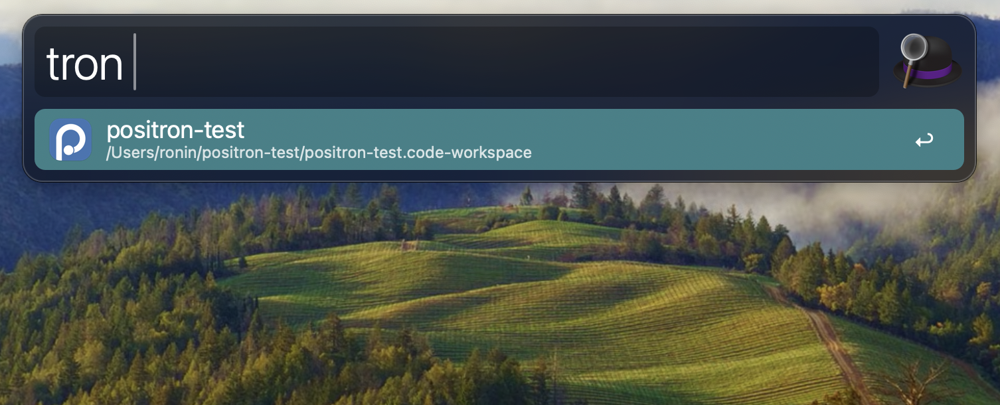

# Positron - Project Manager for Alfred

Simple integration of [Project Manager (OpenVSX)](https://open-vsx.org/extension/alefragnani/project-manager) with [Alfred](https://www.alfredapp.com/).

It supports both VSCode Project manager static projects and Git projects, sorted by usage.

You can obtain a copy by going to the [releases/](./releases) folder, press v1.0.0, and select "Raw". Once downloaded, double click to install in Alfred.

### Acknowledgements

This workflow is heavily based on the [VSCode Project Manager for Alfred](https://github.com/kopiro/vscode-project-manager-for-alfred) variant by [Flavio Maria De Stefano (kopiro)](https://github.com/kopiro).
